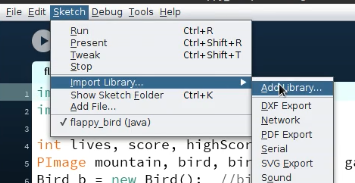
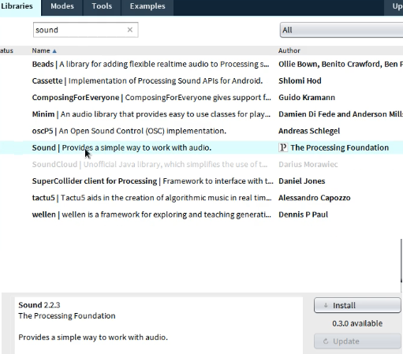
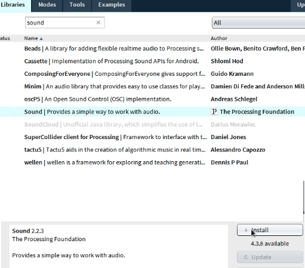
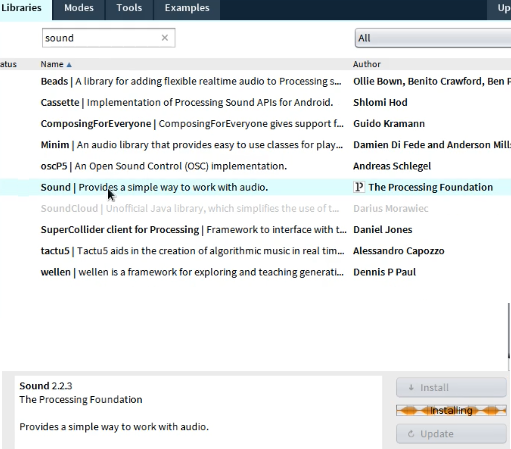
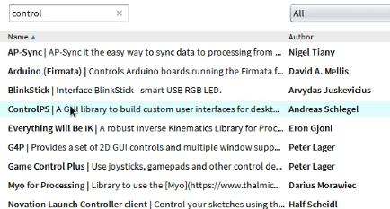

# Flappy Bird
a simple flappy bird game with 3 difficulties (easy, medium, hard)
the game was made using processing language/IDE

## dependencies
* JRE 8 
    needed to run processing
* [Sound library](https://processing.org/reference/libraries/sound/index.html) for processing 3
* [ControlP5 library](http://www.sojamo.de/libraries/controlP5/)
    used in game GUI elements

### installing libraries
for the code to run successfully you need to install the used libraries

1- open processing and from sketch list choose import library then add library

2- search for sound library and install it4

3- do the same to install controlP5 library

## Team Members
>* Mohammad Ashraf : [@elhedeq](https://github.com/elhedeq)
>* Mohammad Massoud : [@massoudsalem](https://github.com/massoudsalem)
>* Omar Ali : [@OmarAli3](https://github.com/OmarAli3)
>* Ahmed Hafez : [@Ahmed-Hafez](https://github.com/Ahmed-Hafez)
>* Khalid Mahmoud : [@Khalid-MahmouD](https://github.com/Khalid-MahmouD)

